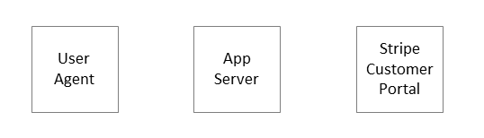

# Step 2 - Implement a Redirect

!!! info ""
    We have a **user** logged into our app
    and we would like them to use the **portal** to subscribe to our **app**.

## How it works

We need to do two things:

1. Tell the portal who our user is. 
2. Hand-off our user to the portal.

We tell the portal through a **redirect** which forms a kind of _handshake_ between
our app and the portal before passing the user to the portal.

## In detail

  

1. We display a button to our user to enable them to create or manage their subscription.
When clicked, this button **posts** a request to our App Server.

2. Our App Server receives the POST request and posts a separate request to the 
**Stripe Customer Portal**. This second request contains the `user_id` of our
current user and the `stripe_api_key` of our app and aims to start a **session** with the portal.

3. Assuming all good the **portal** responds with a `stripe_identifier`
and a `stripe_url`.

4. Our App Server stores the `stripe_identifier` against the `user_id` for future
reference and redirects our user to the `stripe_url`.

## What just happened

At the end of the flow described above:

* Stripe has an identifier for the user that we understand (the `user_id`).
* We have an identifier for the user that Stripe understands (the `stripe_identifier`).
* This means we can refer to the same user when sharing information.
* Our user is sent to the portal to make their selection.

